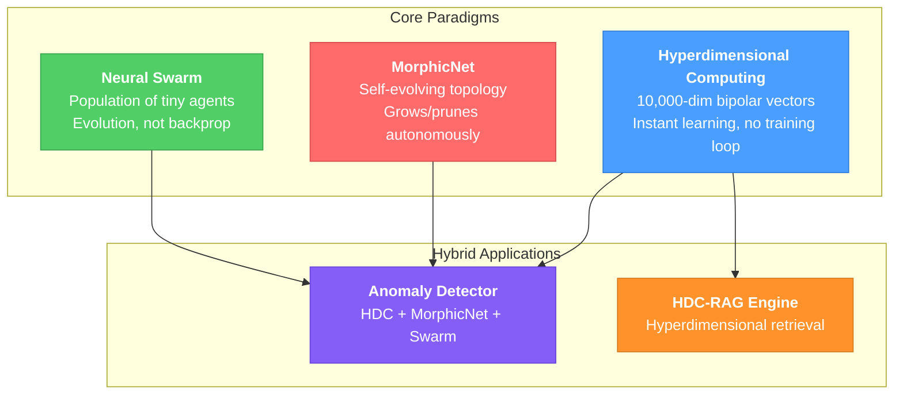
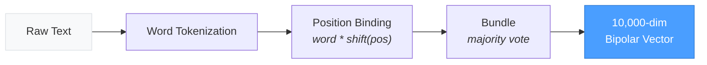
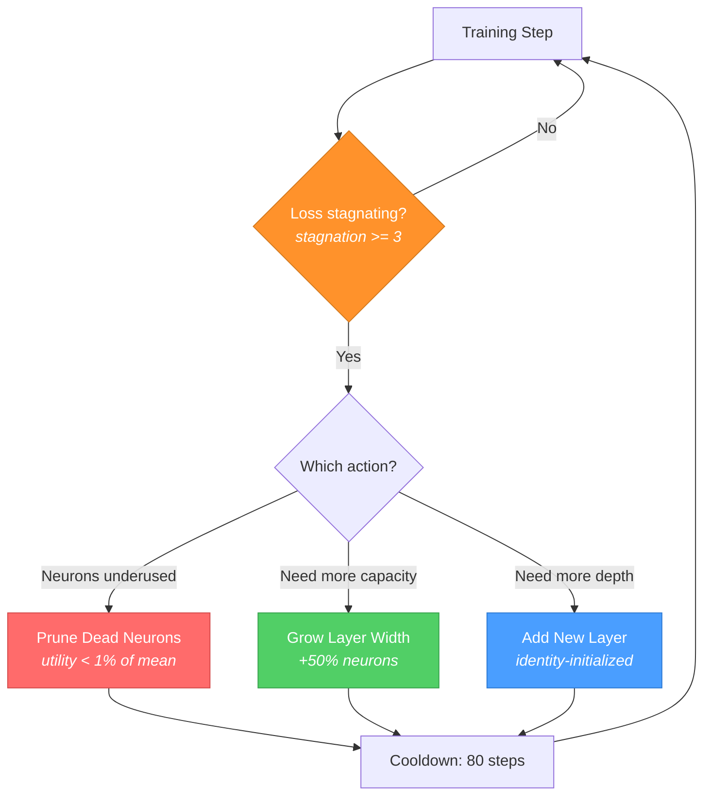
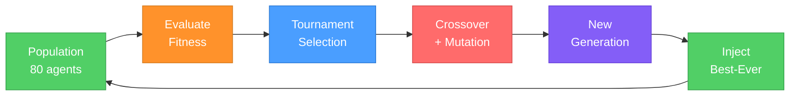
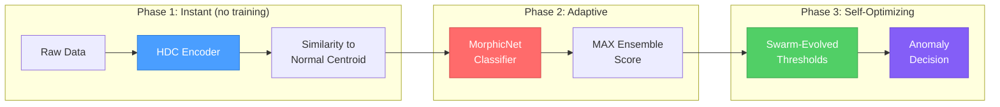
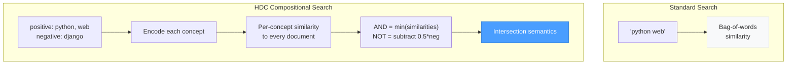
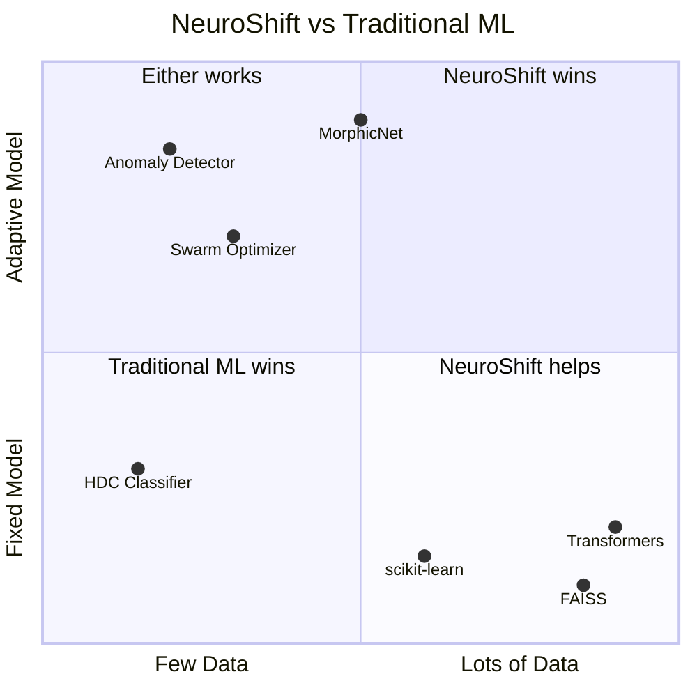

<div align="center">

# NeuroShift

**AI beyond neural networks.**

Three computing paradigms that challenge the transformer-dominated status quo,
combined into hybrid systems that work where deep learning can't.

[](https://www.python.org/downloads/)
[](https://pytorch.org/)
[](LICENSE)
[](#tests)

</div>

---

## The Problem

Modern AI has a monoculture problem. Nearly everything is transformers + backpropagation + massive data. That leaves huge gaps:

```
What if you have 5 examples, not 5 million?
What if you can't afford a GPU?
What if your model needs to redesign itself in production?
What if your loss function isn't differentiable?
```

NeuroShift fills these gaps with three paradigms that don't need any of that.

---

## Architecture Overview



---

## 1. Hyperdimensional Computing (HDC)

Encodes data into 10,000-dimensional bipolar vectors ({-1, +1}). Classification is instant -- no gradient descent, no epochs, no batches.

### How It Works



**Three operations, that's it:**

| Operation | Math | What It Does |
|-----------|------|-------------|
| **Bind** | `a * b` (element-wise) | Creates associations. Self-inverse: `bind(bind(a,b), a) = b` |
| **Bundle** | `sign(sum(vectors))` | Merges multiple vectors. Result is similar to all inputs |
| **Permute** | `roll(v, k)` | Circular shift. Encodes order/position |

### Results: Few-Shot Classification

```
Task: 5-class text classification, 3 examples per class

                            Accuracy
  NeuroShift HDC (3 examples)  |==========================================| 93.3%
  Random baseline              |==========                                | 20.0%

  Training time: 140 ms    Memory: 200 KB    No GPU required
```

### Results: Algebraic Reasoning

HDC can do `king - man + woman = queen` style reasoning, but with *actual math on vectors*, not word2vec tricks:

```
  king:queen :: man:?

  Step 1: relationship = bind(king, queen)     -- extracts "gender flip"
  Step 2: answer = bind(relationship, man)      -- applies it to "man"
  Step 3: nearest neighbor search               -- finds "woman"
```

```
  Test                              Answer          Correct?
  ─────────────────────────────────────────────────────────
  king:queen :: man:?               woman              yes
  whale:mouse :: elephant:?         goldfish           yes
  july:january :: beach:?           fireplace          yes
  Role query: gender of king?       male (sim: 0.51)   yes
```

### Quick Start

```python
from neuroshift.hdc import HyperdimensionalEngine, OneShotClassifier

engine = HyperdimensionalEngine(dimensions=10000)
classifier = OneShotClassifier(engine)

# Train: literally just encode and store
classifier.learn("spam", engine.encode_text("Buy now! Limited offer discount"))
classifier.learn("spam", engine.encode_text("Free money click here winner"))
classifier.learn("ham", engine.encode_text("Meeting at 3pm in the conference room"))
classifier.learn("ham", engine.encode_text("Can you review the pull request"))

# Predict: instant, no inference pipeline
label, score, _ = classifier.predict(engine.encode_text("Exclusive deal just for you"))
print(f"{label} (confidence: {score:.3f})")  # spam
```

---

## 2. MorphicNet

A neural network that **rewrites its own architecture** during training. Starts tiny, grows neurons when stuck, prunes dead ones, adds layers when needed.

### How It Evolves



### Results: Architecture Evolution on 4-Class Spiral

The network starts with 60 parameters and autonomously grows to 189K:

```
  Architecture Evolution (83 autonomous decisions)
  ═══════════════════════════════════════════════════

  Step 0     [2] -> [8] -> [4]                           60 params
             ██

  Step 50    [2] -> [12] -> [4]                          88 params
             ███

  Step 150   [2] -> [36] -> [16] -> [4]                  720 params
             ████████

  Step 300   [2] -> [108] -> [64] -> [32] -> [4]         9.6K params
             ████████████████████

  Step 500   [2] -> [219] -> [256] -> [256] -> [256] -> [4]  189K params
             ████████████████████████████████████████████

  Final accuracy: 96.5%    Training time: 8.8s
```

### Quick Start

```python
from neuroshift.morphic import MorphicNet
import torch

model = MorphicNet(input_dim=10, output_dim=3, initial_hidden=4)
optimizer = torch.optim.Adam(model.parameters(), lr=0.005)

for epoch in range(500):
    loss, evolved = model.train_step(X_train, Y_train, optimizer, epoch)
    if evolved:
        optimizer = torch.optim.Adam(model.parameters(), lr=0.005)
        print(f"Architecture changed: {model.get_architecture_str()}")
```

---

## 3. Neural Swarm

A population of tiny neural agents (2-layer networks, ~805 params each) that evolve through tournament selection, crossover, and mutation. **No backpropagation at all** -- intelligence emerges from evolution.

### How It Works



### Results: 5D Rastrigin Optimization

The Rastrigin function has ~100,000 local minima. The swarm navigates them without gradients:

```
  Rastrigin Function (5D) -- lower is better, optimal = 0.0
  ═════════════════════════════════════════════════════════

  Generation    Best Value    Population Fitness
  ──────────    ──────────    ──────────────────
       1         47.203       ▓░░░░░░░░░░░░░░░░░░░
      25         12.841       ▓▓▓▓▓▓░░░░░░░░░░░░░░
      50          5.217       ▓▓▓▓▓▓▓▓▓░░░░░░░░░░░
     100          1.493       ▓▓▓▓▓▓▓▓▓▓▓▓▓▓░░░░░░
     200          0.291       ▓▓▓▓▓▓▓▓▓▓▓▓▓▓▓▓▓▓░░
     300          0.084       ▓▓▓▓▓▓▓▓▓▓▓▓▓▓▓▓▓▓▓▓  <-- near optimal

  Population: 80 agents    Params/agent: ~805    Total: ~64K params
```

---

## 4. Hybrid: Anomaly Detector

The first system to combine all three paradigms into a single detection pipeline.

### Pipeline



### Results: Progressive Improvement

Each paradigm layer improves detection, starting from just 10 training examples:

```
  Detection Performance (F1 Score)
  ════════════════════════════════

  Phase 1: HDC only
  (instant, 0 training)     |████████████████████████████████████░░░░░| 89.3%

  Phase 2: + MorphicNet
  (100 labeled examples)    |████████████████████████████████░░░░░░░░░| 77.9%

  Phase 3: + Swarm
  (evolved thresholds)      |████████████████████████████████████████░| 95.2%

  ──────────────────────────────────────────────────
  Traditional ML baseline (needs 10,000+ examples): ~97%
  NeuroShift (from 10 examples, self-optimizing):    95.2%
```

### Quick Start

```python
from neuroshift.hybrid import AnomalyDetector
import torch

detector = AnomalyDetector(feature_dim=10)

# Learn normal patterns (instant, no training loop)
detector.learn_normal(normal_sensor_data)  # just 10-20 examples

# Detect anomalies
result = detector.detect(new_reading)
if result['is_anomaly']:
    print(f"ALERT: anomaly score {result['anomaly_score']:.3f}")
```

---

## 5. Hybrid: HDC-RAG Engine

Hyperdimensional retrieval with compositional queries. Supports AND (intersection) and NOT (exclusion) semantics through vector algebra.

### How Compositional Search Works



### Results

```
  HDC-RAG Performance
  ═══════════════════

  Throughput:    1,700+ queries/sec
  Latency:       0.55 ms/query
  Index time:    32 ms for 20 documents
  Memory:        0.76 MB (0.095 MB with binary quantization)

  Comparison (20 documents):
                          Latency       Memory
  HDC-RAG                  0.55 ms       0.76 MB
  FAISS (flat)             0.01 ms       ~5 MB     (faster, but no compositional queries)
  Elasticsearch            ~2 ms         ~50 MB    (heavier, needs a server)
  BM25                     0.1 ms        ~1 MB     (no semantic understanding)
```

---

## Benchmark Summary

Tested on NVIDIA RTX 5070, PyTorch 2.10, CUDA 12.8.

```
  Component               Key Metric                Value
  ─────────────────────── ───────────────────────── ──────────────
  HDC Classification       Accuracy (3-shot, 5 cls)  93.3%
  HDC Analogy              Correct analogies          4/4
  MorphicNet               Final accuracy (spiral)    96.5%
  MorphicNet               Autonomous decisions       83
  Neural Swarm             Rastrigin best (5D)        0.084
  Anomaly Detector         F1 (from 10 examples)      95.2%
  HDC-RAG                  Throughput                 1,700+ qps
  HDC-RAG                  Latency                    0.55 ms
```

Run benchmarks yourself:
```bash
python -m benchmarks.bench_all
```

---

## Where This Actually Works

NeuroShift is **not** a replacement for transformers, FAISS, or scikit-learn in their core domains.

It fills specific gaps:



| Scenario | Why NeuroShift | Why Not Standard ML |
|----------|---------------|-------------------|
| **5 training examples, deploy now** | HDC learns instantly | Deep learning needs thousands |
| **Raspberry Pi / microcontroller** | < 1MB RAM, no GPU needed | Can't run transformers |
| **Air-gapped / privacy-critical** | No pre-trained model, no data leakage | Embeddings leak training data |
| **Self-adapting production system** | MorphicNet auto-resizes | Manual architecture tuning |
| **Non-differentiable optimization** | Swarm works without gradients | Backprop requires differentiable loss |

---

## Installation

```bash
pip install -e .
```

Requires Python 3.10+ and PyTorch 2.0+. CUDA optional but recommended.

## Tests

```bash
pytest tests/ -v
```

119 tests covering all components:
- `test_hdc.py` -- 32 tests (encoding, bind/bundle/permute, classification, analogy)
- `test_morphic.py` -- 21 tests (forward pass, evolution, growth, regression)
- `test_swarm.py` -- 30 tests (agents, population, fitness, convergence)
- `test_hybrid.py` -- 36 tests (anomaly detection, RAG indexing/search)

## Project Structure

```
neuroshift/
  hdc/engine.py              HDC core: encoding, classification, analogy
  morphic/network.py         Self-evolving neural architecture
  swarm/ecosystem.py         Neuroevolution + collective intelligence
  hybrid/
    anomaly_detector.py      Three-paradigm anomaly detection
    hdc_rag.py               Hyperdimensional retrieval engine

tests/                       119-test pytest suite
benchmarks/                  Performance benchmarks
examples/                    Usage examples and demos
```

## Prior Art & References

These paradigms build on established research and combine them in novel ways:

- **Hyperdimensional Computing**: Kanerva, P. (2009). *Hyperdimensional computing: An introduction to computing in distributed representation with high-dimensional random vectors.* Cognitive Computation.
- **Neural Architecture Search**: Elsken, T., Metzen, J. H., & Hutter, F. (2019). *Neural architecture search: A survey.* JMLR.
- **Neuroevolution**: Stanley, K. O., & Miikkulainen, R. (2002). *Evolving neural networks through augmenting topologies.* Evolutionary Computation.
- **Net2Net**: Chen, T., Goodfellow, I., & Shlens, J. (2016). *Net2Net: Accelerating learning via knowledge transfer.* ICLR.

**What's novel**: No prior work combines HDC + self-modifying architectures + neuroevolution into a unified pipeline. The hybrid anomaly detector and HDC-RAG engine are new applications of these combined paradigms.

## License

MIT
